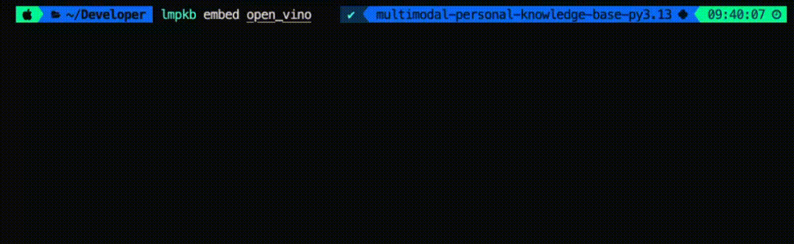
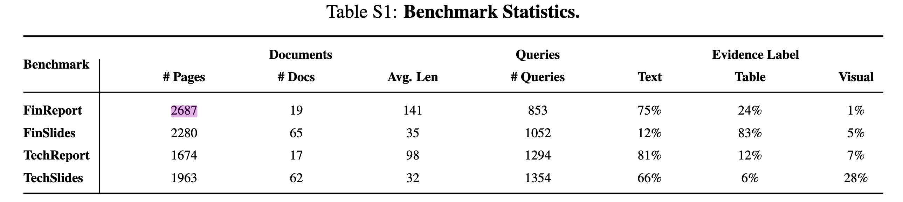
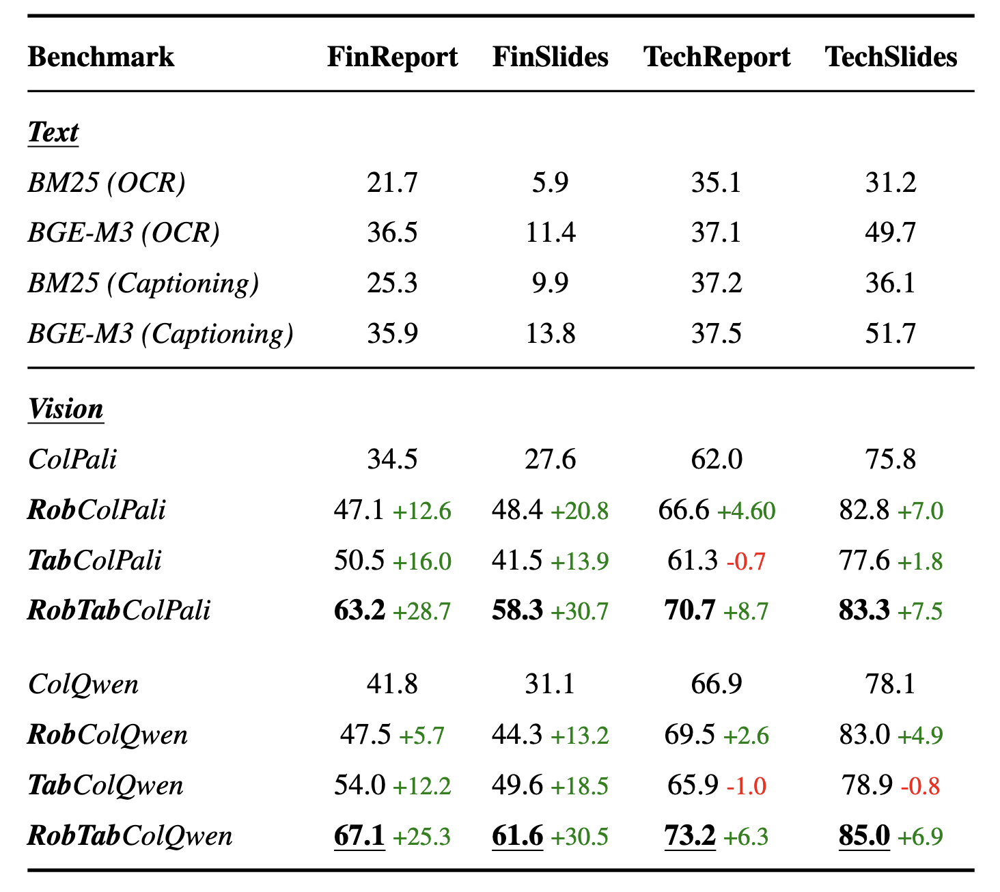
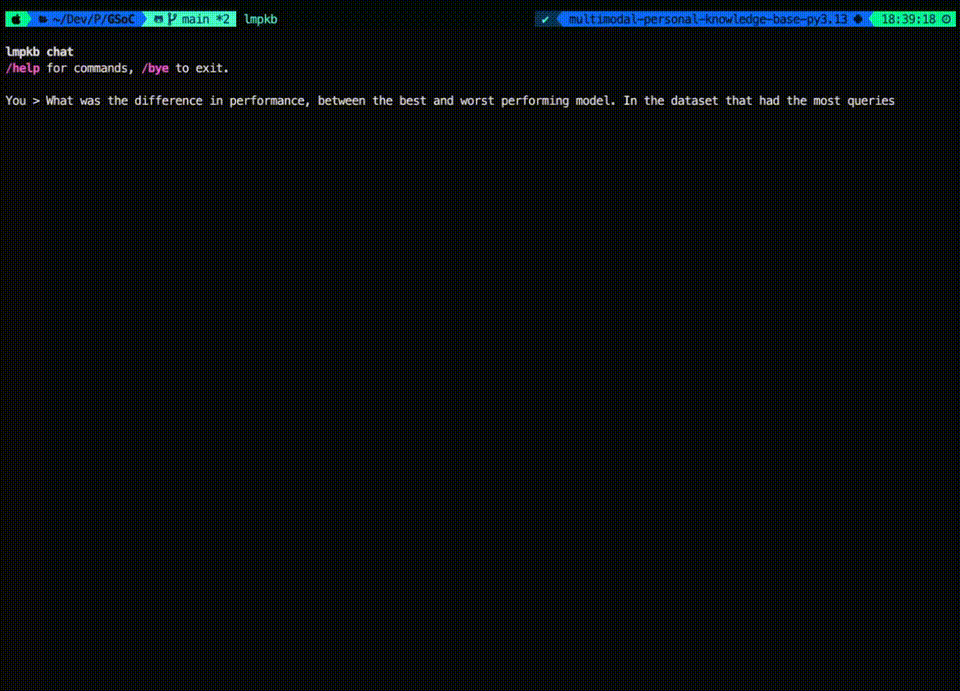

# Local Multimodal Personal Knowledge Base

Local multimodal RAG for personal documents.

The pipeline is:
1. Convert PDF pages to images
2. Embed pages with VoyageAI
3. Store vectors in Chroma
4. Run a retrieval-first agent with a retrieve loop (`retrieve` -> `retrieve` -> ... -> `final_answer`)

## Features

- PDF page-level ingestion and indexing
- Image-first retrieval over document pages
- Multi-hop retrieval loop with explicit tool actions
- Provider-agnostic LLM setup via config (`ollama` or `openai`)
- YAML + CLI config precedence (CLI overrides YAML)

## Requirements

- Python `>=3.11,<3.14`
- Poetry
- Provider credentials:
  - VoyageAI key for embeddings
  - OpenAI key if using `openai` models
  - Ollama running locally if using `ollama` models

## Installation

```bash
poetry install
```

If you use Ollama, pull your model first:

```bash
ollama pull qwen3-vl:4b
```

## Configuration

Runtime config is resolved from:
1. CLI flags
2. YAML file (`--config`, or auto-detected `lmpkb.yaml` )

There are no fallback defaults for agent runtime settings. Missing required fields raise an error.

### `lmpkb.yaml` example

```yaml
model:
  type: openai        # openai | ollama
  name: gpt-5.2
  reasoning:
    effort: medium    # openai: none|minimal|low|medium|high|xhigh
    summary: detailed # openai: auto|concise|detailed (optional)

retrieve:
  top_k: 3
```

Ollama reasoning format:

```yaml
model:
  type: ollama
  name: qwen3-vl:4b
  reasoning: false    # true|false

retrieve:
  top_k: 3
```

## CLI

### `embed`

Indexes all PDFs under a folder.




### `retrieve`

Retrieves top matching pages for a question, without generation.


### `query`

Runs the agent loop (iterative retrieval + final answer). You can override YAML from CLI:

OpenAI override example:

```bash
lmpkb query "..." \
  --model-type openai \
  --model gpt-5.2 \
  --reasoning medium \
  --top-k 3
```

Ollama override example:

```bash
lmpkb query "..." \
  --model-type ollama \
  --model qwen3-vl:4b \
  --reasoning false \
  --top-k 3
```


**Needed Context 1 (Page 14)**

<p align="center">
  
</p>


**Needed Context 2 (Page 7)**

<p align="center">
  
</p>

**Multi Hop Retrieval**



## Key Query Flags

- `--config`, `-c`: Path to YAML config
- `--model-type`: `ollama` or `openai`
- `--model`: model name
- `--reasoning`:
  - `ollama`: boolean (`true`/`false`)
  - `openai`: effort (`none|minimal|low|medium|high|xhigh`)
- `--top-k`: retrieval count for query

## Project Structure

```text
lmpkb/
├── cli.py                    # Typer commands: embed / retrieve / query
├── ingest/
│   └── pdf.py                # PDF -> page images
├── embed/
│   └── embedder.py           # VoyageAI multimodal embeddings
├── store/
│   └── vector_store.py       # Chroma persistence + retrieval
└── agent/
    ├── agent.py              # Main tool-calling loop
    ├── config.py             # YAML + CLI config resolution/validation
    ├── llm_factory.py        # Provider-specific LLM creation
    ├── tools.py              # retrieve/final_answer tools
    └── ui.py                 # terminal rendering + reasoning parsing
```
