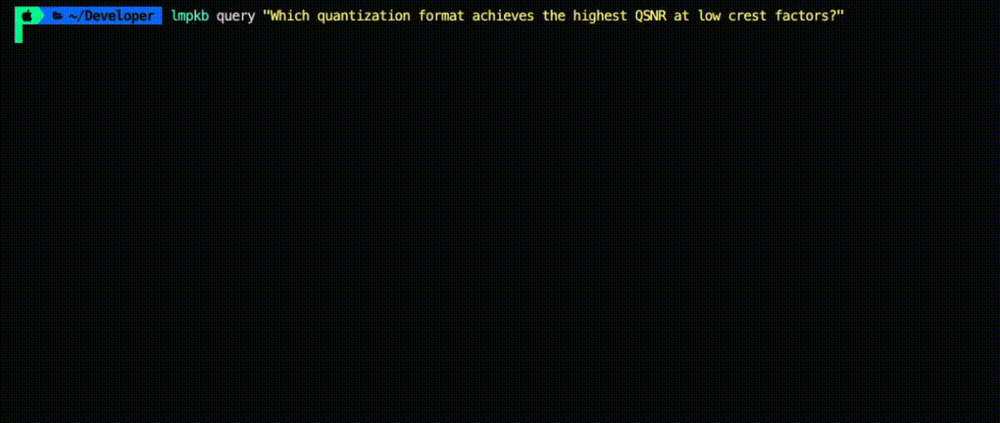
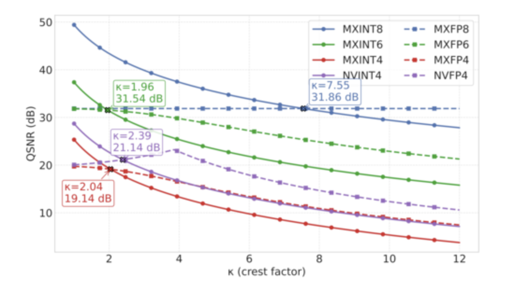

# Local Multimodal Personal Knowledge Base

Local multimodal RAG for personal documents. Pages are embedded as images and queried through a local vision LLM via Ollama. Fully CLI-driven.

## Stack

Defaults — all swappable via CLI flags or env vars.

| Component | Default |
|---|---|
| Embeddings | VoyageAI (`voyage-multimodal-3`) |
| Vector store | Chroma |
| LLM | Ollama (`qwen3-vl:4b`) |
| CLI | Typer |

## Setup

Install dependancies:

```bash
poetry install
```

Pull the model:
```bash
ollama pull qwen3-vl:4b
```

## Repo Structure

```
lmpkb/
├── cli.py                # entry point — embed / retrieve / query commands
├── ingest/
│   └── pdf.py            # PDF → page images (PyMuPDF)
├── embed/
│   └── embedder.py       # image + query embeddings
├── store/
│   └── vector_store.py   # vector store persistence + retrieval
└── agent/
    └── agent.py          # Ollama — question + images → answer
```

## Usage

### `embed` — index a folder of PDFs


### `retrieve` — inspect what pages would be retrieved

Useful for debugging retrieval quality without calling the LLM.


### `query` — retrieve + generate an answer




**Correct Answer (Page 3)**



Options:

| Flag | Default | Description |
|---|---|---|
| `--top-k` | `3` (retrieve) / `1` (query) | Number of pages to retrieve |
| `--model` | `qwen3-vl:4b` | Ollama model (overrides `OLLAMA_MODEL` env var) |
